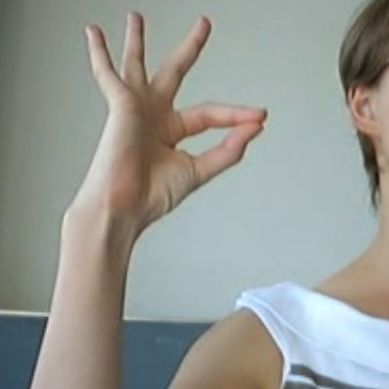
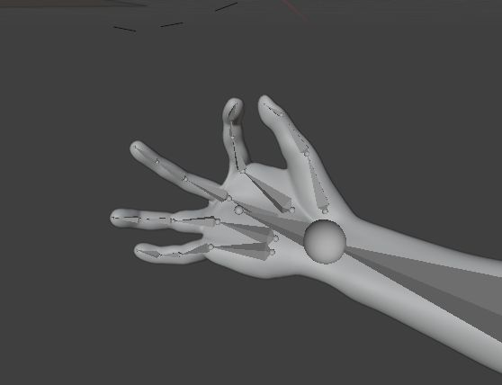

Instructions for Hand Pose Conversion Using Python and Blender 4.1
Prerequisites

To run this project, you'll need the following software:

    Python
    Blender 4.1

Steps to Run the Project

    Generate Pose Files
        First, run the Hand2Pose Jupyter notebook to create the necessary pose files from the dataset any hand RGB images dataset will work but we provided one bellow. This step will generate the pose data required for the subsequent stages.

    Load and Configure Blender
        Open the provided Blender file.
        Input your base and target poses within Blender.

    Note: This process only works for poses within the same class.
[MINST Hand pose dataset](https://github.com/mon95/Sign-Language-and-Static-gesture-recognition-using-sklearn/tree/master)
